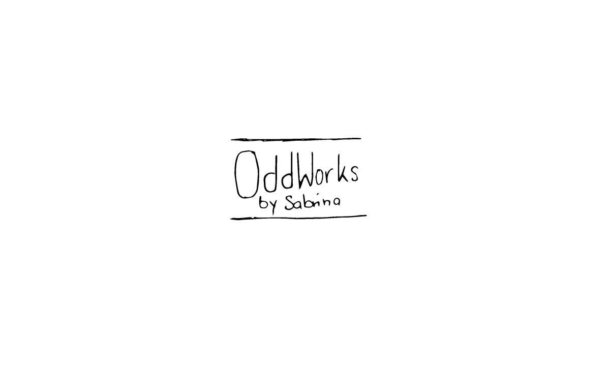

---
# You don't need to edit this file, it's empty on purpose.
# Edit theme's home layout instead if you wanna make some changes
# See: https://jekyllrb.com/docs/themes/#overriding-theme-defaults
layout: single
author_profile: true
---

Jemand musste Josef K. verleumdet haben, denn ohne dass er etwas Böses getan hätte, wurde er eines Morgens verhaftet. »Wie ein Hund!« sagte er, es war, als sollte die Scham ihn überleben. Als Gregor Samsa eines Morgens aus unruhigen Träumen erwachte, fand er sich in seinem Bett zu einem ungeheueren Ungeziefer verwandelt. Und es war ihnen wie eine Bestätigung ihrer neuen Träume und guten Absichten, als am Ziele ihrer Fahrt die Tochter als erste sich erhob und ihren jungen Körper dehnte. »Es ist ein eigentümlicher Apparat«, sagte der Offizier zu dem Forschungsreisenden und überblickte mit einem gewissermaßen bewundernden Blick den ihm doch wohlbekannten Apparat.
